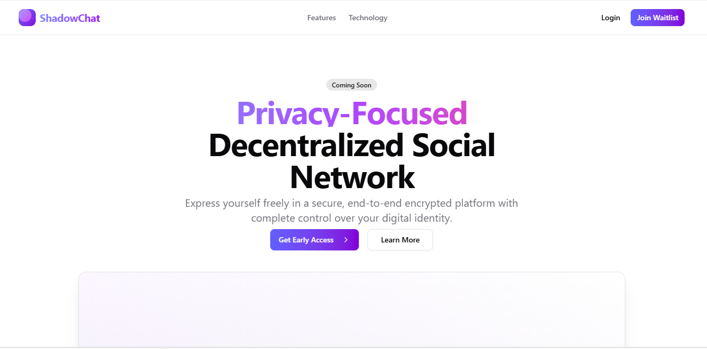

<p align="center">
 
</p>

<h1 align="center">ShadowChat: Privacy-Focused Decentralized Social Network</h1>

<p align="center">
  <a href="https://your-build-link-here">
    
  </a>
</p>

<p align="center">
  <a href="https://cairo-lang.org">
    
  </a>
  <a href="https://reactjs.org">
    
  </a>
  <a href="https://nextjs.org/">
    
  </a>
</p>

<p align="center">
  <a href="https://t.me/shadowchat_od">
    
  </a>
</p>

## Overview
ShadowChat is a **privacy-first decentralized social platform** built on **Starknet**, enabling users to engage in **anonymous discussions**, form **hidden communities**, and communicate securely without revealing their real-world identities.
By leveraging **ZK-Rollup technology**, ShadowChat ensures **censorship-resistant interactions** with **end-to-end encryption** and **decentralized storage**.

## **Key Features & Security** 

ShadowChat is designed for **privacy-first, censorship-resistant communication** with: 

- **🔒 Anonymous Identity** – No personal details required; engage freely. 
- **🛡️ End-to-End Encryption (E2EE)** – Messages and media stay **fully encrypted** and private. 
- **🔗 Zero-Knowledge Authentication** – Verify access **without exposing personal data**. 
- **🏛️ Decentralized Communities** – Join and create groups with **secure, hidden interactions**. 
- **⚖️ Smart Contract-Based Chatting** – **Tamper-proof** conversations with no central control. 
- **📜 On-Chain Governance** – Community-driven **DAO voting** for decision-making. 
- **🚫 Censorship-Resistant** – No authority can **modify or delete** content. 
- **⚡ Starknet L2 Scaling** – **Fast, low-cost transactions** powered by **Cairo VM**. 

## Build Status
- **Current Version:** Stable
- **Development Status:** Active
- **Latest Updates:** Performance improvements and UI enhancements

## Tech Stack
- **Frontend:** Next.js
- **Smart Contracts:** Cairo (Starknet)
- **Storage:** IPFS & Arweave (decentralized)
- **Messaging:** XMTP & Libp2p
- **Authentication:** Starknet wallets (ArgentX, Braavos)
- **Encryption:** End-to-end encryption protocols

## Installation
### Clone the repository
```sh
git clone https://github.com/username/ShadowChat.git
```
### Install dependencies
```sh
npm install  # or yarn or pnpm install or bun install
```
### Running locally
```sh
npm run dev  # or yarn dev or pnpm dev or bun dev
```
### Build commands
```sh
npm run build
```

## How to Use ShadowChat
1. Connect your Starknet wallet (ArgentX or Braavos) to access the platform.
2. Set up an anonymous identity – No personal details required.
3. Join or create private communities to engage in encrypted, censorship-resistant discussions.
4. Send secure messages** that remain private, tamper-proof, and end-to-end encrypted.
5. Participate in decentralized governance by voting on community rules via smart contracts.


## Contributions & Community Engagement 
ShadowChat is an **open-source privacy-focused social network**, and we welcome contributions from developers, designers, and privacy advocates! 

### How to Contribute 
- **📜 Follow our [Contribution Guide](https://github.com/SudiptaPaul-31/ShadowChat/commit/39a563a9fcc262ac124c275a9979870e15becfa6)** to learn how you can get involved. 
- **🛠 Refer to our [Setup Guide](https://github.com/SudiptaPaul-31/ShadowChat/commit/7e100f2412ea046e5c0874471352537399bc5a8c)** for instructions on setting up the project locally. 
- **🐛 Report Issues & Request Features** – Submit bug reports or feature requests via [GitHub Issues](https://github.com/SudiptaPaul-31/ShadowChat/issues). 

### Contributors 
<a href="https://github.com/nn3-oma/shadowchat/graphs/contributors">
  
</a>

<br/>

Want to be part of this list? **Start contributing today!** 

### Stay Connected 
- **💬 Join Discussions** – Connect with other users and developers in our [Telegram Group](https://t.me/shadowchat_od). 
- **🌟 Follow Development Updates** – Star our [GitHub Repository](https://github.com/SudiptaPaul-31/ShadowChat) to stay updated on new features and releases. 
- **📢 Spread the Word** – Share ShadowChat with your network and help us build a censorship-resistant future! 

## License 
ShadowChat is released under the **MIT License**
